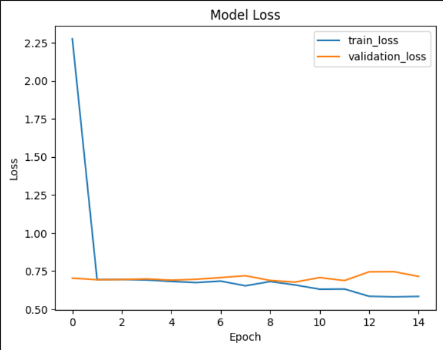

# 🐱🐶 Cat vs Dog Classifier using ResNet50

This project uses **ResNet50**, a pre-trained deep convolutional neural network, to classify images as either **cats** or **dogs**. The model has been fine-tuned and evaluated on the popular binary classification dataset (Cats vs Dogs from Kaggle), achieving over **95% validation accuracy**.

---

## 📌 Overview

* ✅ Built using **TensorFlow** and **Keras**
* ✅ Uses **Transfer Learning** with **ResNet50**
* ✅ Implements **Early Stopping** and **Learning Rate Scheduler**
* ✅ Achieves **95%+ validation accuracy**
* ❗Validation loss indicates **some overfitting** — explored via training curves

---

## 📁 Project Structure

```
cat-vs-dog-resnet50/
├── model/
│   └── resnet50_model.h5        # Trained model
├── data/
│   └── train/val/test folders   # Organized dataset
├── utils/
│   └── preprocessing.py         # Augmentation and preprocessing
├── loss_accuracy_plot.png       # Training vs Validation loss graph
├── main.ipynb                   # from scratch
├── resnet50.py                  # Main training script
└── README.md
```

---

## 📊 Model Performance

* **Training Accuracy from scratch**: \~66%
* **Training Accuracy**: \~99%
* **Validation Accuracy**: \~95%
* **Validation Loss Curve**: Slight overfitting detected after 3rd epoch



---

## ⚙️ Techniques Used

* **Transfer Learning** with ResNet50 (ImageNet weights)
* **Image Augmentation** with `ImageDataGenerator`
* **EarlyStopping** to prevent overfitting
* **ReduceLROnPlateau** for dynamic learning rate adjustment

---

## 🔬 How to Use

1. **Install dependencies**

   ```bash
   pip install -r requirements.txt
   ```

2. **Organize your dataset**

   ```
   /data
     /train
       /cats
       /dogs
     /val
       /cats
       /dogs
   ```

3. **Train the model**

   ```bash
   python resnet50.py
   ```

---

## 💡 Future Improvements

* Add regularization techniques like **Dropout** or **L2**
* Try **data balancing** if class imbalance is found
* Experiment with more **fine-tuning layers**

---

## 🙋‍♂️ Author

* 👨‍💻 [Nithish Kannan M](https://www.linkedin.com/in/nithish-kannan-m/)
* 🏫 2nd Year B.Tech CSE, Vellore Institute of Technology, Chennai
* 🧠 Passionate about ML/AI and automation
* 🤖 Android Club UI/UX Developer

---

